Naomi Martin  
Assignment 07  
August 22, 2022  

# Exception Handling and Pickling in Python

## Introduction
This assignment gave us a little bit more independent initiative toward understanding two main concepts learned this week: exception handling, and pickling. In this assignment, we were asked to do individual research on exception handling and pickling,  

## Research: Exception Handling
Based on my online research, syntax errors and exceptions are two distinct types of errors that may arise in a program. Syntax errors occur when a code has invalid syntax so Python cannot process the intended code correctly, whereas exceptions are other errors detected during program execution that are syntactically correct. Examples of exceptions include the ZeroDivisionError (invalid division by zero), the TypeError (when an operation or function is applied to an object of the wrong type), and the NameError (when a name of a variable, object, or function, for example, is not found), to name a few. According to the textbook, there are over two dozen exception types, of which those listed above are just a few. 

By default, exceptions are not handled by Python, resulting in a confusing error message that beginning programmers may not understand. The built-in exception handling method via try statements with except clauses are a way for programmers to easily catch exceptions, and return a more easily understandable error message. This exception handling method also provides a way for the program to display to the user what went wrong, while not needing to halt the execution of the program. 

An example of handling such errors is as follows, reproduced with changes from GeeksforGeeks.org (Figure 1). 

#### Figure 1. Basic code demonstrating error handling. 

In this program, I want to calculate a simple math equation to find b given a. I defined the function so that the equation b = a / (a-3) runs only if a<4, so that the equation does not divide by zero when a=3. Next, I used the try and except statements to try the equation for each value in range(5), so every value from 0 to 4. For the exception that occurs, the program handles it and continues to execute. Here, we can see an example of two exceptions being handled, by defining each exception in a tuple. For the value of a=3, the equation b would evaluate to b = 3/0, throwing a ZeroDivisionError exception. For the value of a=4, since the function containing the equation was originally defined for a<4 only, the if statement containing the equation would not execute, and therefore b would not exist. Therefore, for the value a=4, a NameError exception would be thrown. 

Each time an exception occurs, it has an argument, which is Python’s default error message. I chose to include that here, to demonstrate that Python’s default message is retained, despite the alternate error message we chose to output for each exception. 

Another way to handle multiple exceptions is to use multiple except clauses. In this way, one is able to tailor error messages more specifically based on the exception (figure 2). 

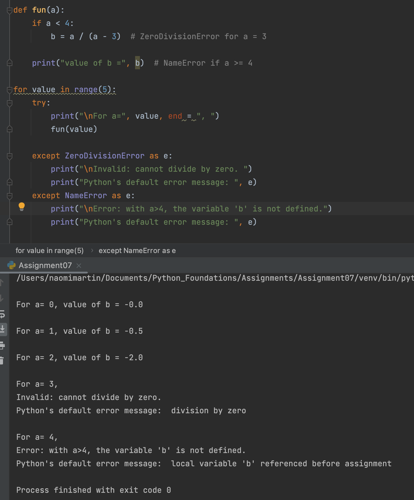
#### Figure 2. Demonstrates the use multiple except clauses for more specific error handling. 

Not shown in the examples above, there are also additional clauses that can be executed under a try statement. The else clause executes in a try statement block if the program did not run into an exception, and is particularly useful in alerting the user of the program that a specific block of code worked. The finally keyword defines a statement that is executed every time, regardless of whether or not an exception was raised. 

My online research supplemented my knowledge gained from Professor Root’s module videos and from the textbook. The websites that helped me the most were the official Python website and GeeksforGeeks.org. I thought these were the most helpful websites, since they both gave comprehensive explanations and definitions for different types of errors, and gave clear examples demonstrating the various ways to handle errors. These websites did so in a comprehensive way that was also easy to understand, whereas other websites either did not convey the information clearly, or gave too basic a rundown that was necessary to fully understand the concept. 

For more information, see the referenced links below:  
[Official Python Website: Exception Handling](https://docs.python.org/3/tutorial/errors.html)  
[GeeksforGeeks.org: Exception Handling](https://www.geeksforgeeks.org/python-exception-handling/)  

## Research: Pickling
I spent more time researching pickling, as it was a bit more complex to understand, and had more moving parts than exception handling did. Even after my research on it there are plenty of concepts that I do not understand, which I believe should come with time and practice. 
Pickling in Python is the process by which an object is serialized, or converted into a stream of bytes for storage. Unpickling is the opposite, whereby a byte stream contained in a binary file or byte-like object is converted back into a Python object. There are other Python modules that work in a similar way to pickle, such as marshall and json, but pickle offers advantages over either that should be considered when serializing information. For example, marshall is a more primitive serialization protocol that has disadvantages when compared with pickle. Json is a text serialization format whereas pickle is a binary serialization format, and pickle appears to be more relevant for Python applications than json, with pickle involving a Python-specific data format. Because of these differences, care must be taken to carefully choose the best way to serialize information. 

Pickled python objects are often stored in binary files, and can contain a range of complex python objects such a lists, dictionaries, and tuples. The main idea behind pickling is that a python object can be pickled into a file, and unpickled back into its original object type and format so that all original information is preserved. For example, a list is able to be pickled and stored, so that when the data is unpickled, it is converted back into a list. This is in contrast to text files, where specific rows of lists were saved into distinct rows of a text file, as text files can only contain text characters. 

In order to use pickle, one would need to first import the pickle module into the program. One can then pickle and save data using the pickle.dump() function, which takes arguments object_to_pickle, file_name, and [.bin], where [.bin] determines whether the pickled object is written in binary format (when [.bin] = True), or a more human-readable text format (when [.bin] = False). The default value of [.bin] is False. In order to unpickle data, one would use the pickle.load() function, which takes the argument file_name. The function unpickles one object at a time, keeping track of where it had left off to ensure that it does not deserialize the same object twice. The pickle module in general keeps track of where it has left off in both serializing and deserializing, something that marshal does not do, giving pickle a leg up with respect to that. 

The following data types can be pickled: 
-	None, True, False
-	integers, floating point numbers, complex numbers
-	strings, bytes, bytearrays
-	tuples, lists, sets, dictionaries
-	functions defined at the beginning of the program
-	built-in functions

There are, of course, more data types that can be pickled, but those listed above are ones that we have already worked with.

Something else that I came across in my research on pickling is the concept of the “Buffer Protocol” in Python. It is my understanding that the buffer represents underlying memory that is periodically saved to the file in question. This is why one must invoke the .sync() method when using a shelf to store data. A benefit of a buffer is that they can be used to reference a block of memory without referencing the entire block, exposing select data to the programmer in an efficient way. 

I ended up using the same websites to research this concept, as I was already familiar with them, and they had elements that I liked about them. I tried to use other websites but did not find their descriptive style to be as helpful as the official Python website and GeeksforGeeks.org. 

For more information, see the referenced links below:  
[Official Python website: Pickling](https://docs.python.org/3/library/pickle.html)  
[Official Python website: Buffer Objects](https://docs.python.org/3/c-api/buffer.html#bufferobjects)  
[GeeksforGeeks.org: Pickling](https://www.geeksforgeeks.org/understanding-python-pickling-example/)  

## The Line Geometry Calculator Program

I wanted to complete assignment 07 in a creative way that would not only familiarize myself with the methods of exception handling and pickling, but also to solidify concepts already learned in this course. I decided to do so by creating a program that takes user input for the x and y values of two coordinates, and performs basic line geometry calculations: distance between the two points, slope of the line joining the two points, y-intercept of the line joining the two points, and the midpoint between the two points. The calculated data is stored in a dictionary, and the dictionary is then stored in a list. The dictionary elements of this list can be pickled to and unpickled from the binary file. Although not the most practical program for users, I believe that it demonstrated my growing familiarity for various data types (lists, dictionaries, tuples, etc.) and loops (for loops, while loops, if statements, etc), while demonstrating my understanding of exception handling and pickling. 
 
I begin the program by writing a header containing the program title, description, and change log, and define distinct areas for data, processing, and presentation (figure 3). 

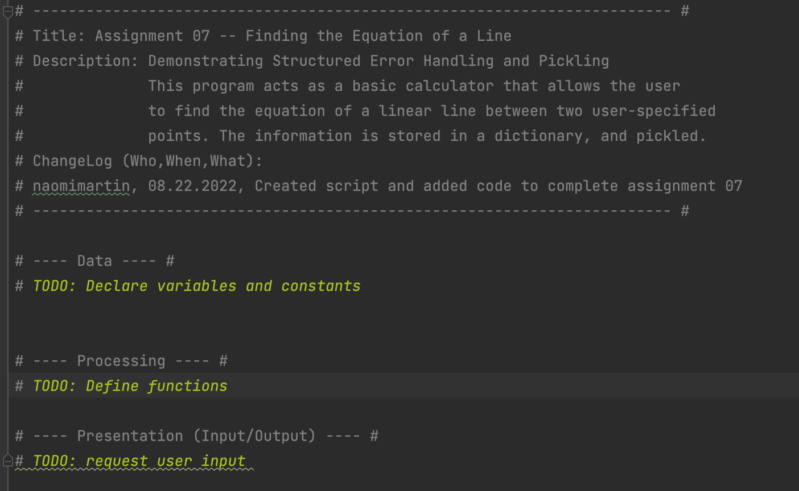
#### Figure 3. Header containing the program title, description, and change log, with distinctly defined areas for data, processing, and presentation. 

Technically, the next thing I did was tackle the process of defining the function to calculate the distance between two points. However, for ease in explaining my program, I will simply go through and explain each line of code in order of appearance in the file, rather than discuss what I did in chronological order. 

The Line Geometry Calculator Program: Data

The figure below shows the first few lines of code of my program (figure 4). 

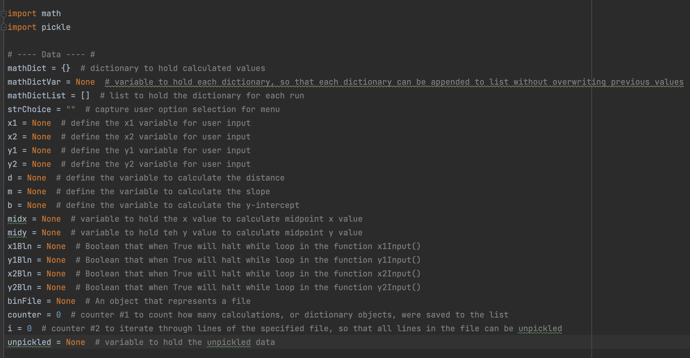
#### Figure 4. Importing modules and defining variables. 

I imported the math and pickle modules to carry out essential functions of this program. The distance between two points formula involves a square root and a number-squared operation, which can be carried out by downloading the math module, as I discovered upon consultation with Google. The pickle module is required for obvious reasons, we want to pickle and unpickle data into and from a binary file.

All variables are clearly defined after the modules are imported. The variables were defined as I was writing the program, whenever I encountered a new variable that needed to be defined. 

### The Line Geometry Calculator Program: Processing

The next part of my code is the Processing section, which defines the functions that I use in the program. For the lines of code that are often repeated, that represent equations, or that are understood easily (such as print statements), I define functions at the top. 

Below shows the distance function, in which I write code to calculate the distance between two points. The function takes the arguments x_1, x_2, y_1, and y_2, which are inputted by the user. The function returns the variable d which represents the distance between the two points. I include a print function to display a message to the user what the calculated value is (figure 5). 

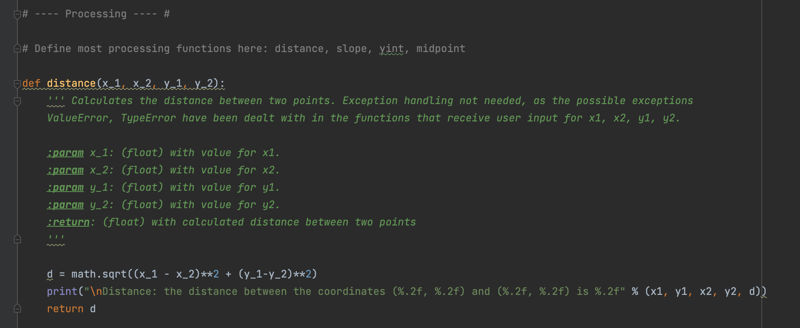
#### Figure 5. Code for the distance function. 

The next function defined in my code is the slope function. This function takes the arguments x_1, x_2, y_1, and y_2, which are inputted by the user, and returns the variable m which represents the slope of the line conjoining the two points (figure 6). 

 
#### Figure 6. Code for the slope function. 

In this function, there is a possibility to raise the ZeroDivisionError exception if the two user-inputted x-values are equal. Therefore, I wrote code to handle this possibility. Using a try statement and except clause, I specify that if the ZeroDivisionError exception is encountered, the m variable containing the value for slope is assigned the character string “INVALID DUE TO DIVISION BY ZERO.” A message is then printed that alerts the user of the exception, and prints the message that Python would normally print when this exception is encountered, using the exception argument e. The fact that the m variable contains a string of characters is important to remember for the next function. If the exception is not encountered, a message is printed that shows the user what the calculated slope value is. 

The next function defined in my code is the y-intercept function. This function takes the arguments x_1, and y_1, which are inputted by the user, as well as m, the value for slope calculated in the previous function, and returns the variable b which represents the y-intercept of the line conjoining the two points (figure 7).

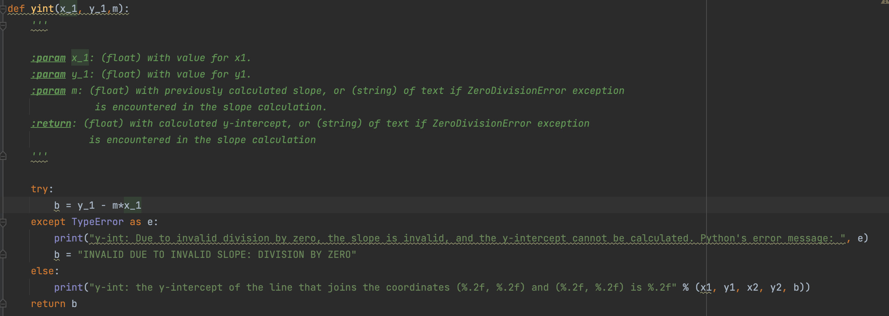
#### Figure 7. Code for the y-intercept function. 

As stated previously, it is important to remember that m contains a string of text if the ZeroDivisionError exception is encountered in the slope function. In this case, since m would be a string and not a floating point or integer value, the data types of which are required for the mathematical equation defined in this function, the program would throw a TypeError exception if not handled properly. I use a try statement and except clause to specify that if a TypeError exception is encountered, the variable b is also assigned a string that says that the y-intercept is invalid due to an invalid slope. A message is also printed to inform the user that the y-intercept could not be calculated due to an invalid slope, and shows the user what Python’s normal error message would be if this exception is encountered. If the TypeError exception is not encountered, that would mean that the ZeroDivisionError was not encountered in the slope function, and the y-intercept function can successfully calculate the value of the y-intercept. A message is again printed to the user to inform them of the successful calculation. 

The next function defined is the midpoint function. This function takes the arguments x_1, x_2, y_1, and y_2, which are inputted by the user, and returns the variables midx and midy which represent the x and y coordinates of the midpoint (figure 6). Exception handling is not required for this function. 

#### Figure 8. Code for the midpoint function. 

### The Line Geometry Calculator Program: Presentation

The next functions defined are under the “Presentation” section of the code. The welcome function prints a long message that describes what the program does (figure 9). 

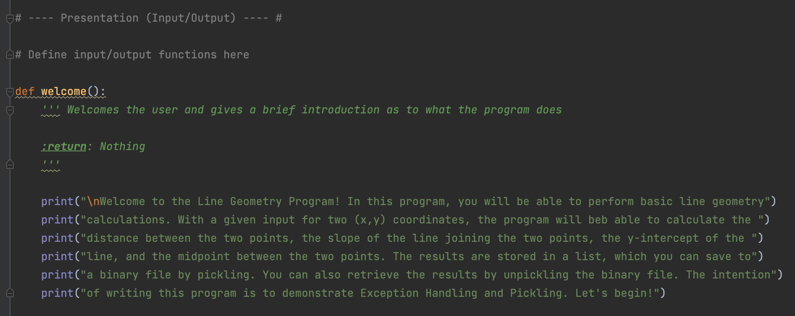
#### Figure 9. Code for the welcome function. 

I then define the functions that request user input for the x1, x2, y1, and y2 values. The figure below shows the code for the function that gets the x1 value from the user (figure 10).

#### Figure 10. Code for the function to get user input for the x1 coordinate. 

Here, I used a technique that Professor Root used in Assignment05, to continue looping through the while loop if an invalid option is given. At the top of the function, I assign the x1Bln value a Boolean value of True, which will be used as a condition to exit the while loop. In the while loop, I request user input for the variable x1. Since we want to enforce the user to only enter in number values, I use a try statement to see if the user input can be converted to a floating-point value. If the input cannot be converted to a floating-point value, a ValueError (a string is entered but cannot be converted to a floating-point value) or a TypeError (if the input is “None”) will be thrown. In either of these cases, the exception arises because a number value was not inputted by the user. Therefore, I write a print statement to inform the user that only a number can be inputted, and shows what Python’s normal error message would be. If an exception is encountered and the input is invalid, the x1Bln value is assigned a value of False. If the exception is not encountered, the condition is assigned a value of True. If x1Bln is False, the while loop continues to execute until a valid numerical value is obtained from the user. If x1Bln is True, the while loop breaks, and the function is complete. The variable x1 is then returned from the function, for later use in the program. 

The code for the functions to obtain user input for the x2, y1, and y2 values are exactly the same as that for the function to obtain user input for x1, except with the corresponding value specified. 

The next presentation functions I define are the output_menu_tasks and input_menu_choice functions. These functions do not take in any variables. The output_menu_tasks function simply prints the menu of options for the user to view every time a menu option is completed. It does not return any variables. The input_menu_choice function gets user input for which menu choice they would like to carry out, and returns the choice variable for use in if statements later in the program (figure 11). 

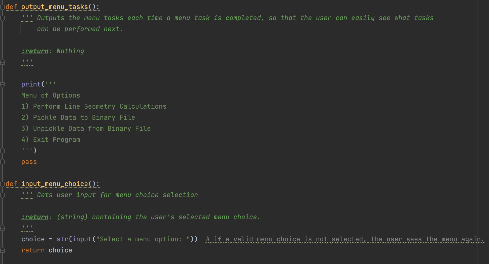
#### Figure 11. Code for the output_menu_tasks() and input_menu_choice() functions. 

### The Line Geometry Calculator Program: Main Body, Menu Option 1

Once all the functions are defined, the main body of the script can execute. In a while loop, which exits with menu option 4, I first call the output_menu_tasks() and input_menu_choice() functions. Once user input for menu choice is obtained, the various menu options can be executed. The figure below shows the code for menu option 1 (figure 12). 

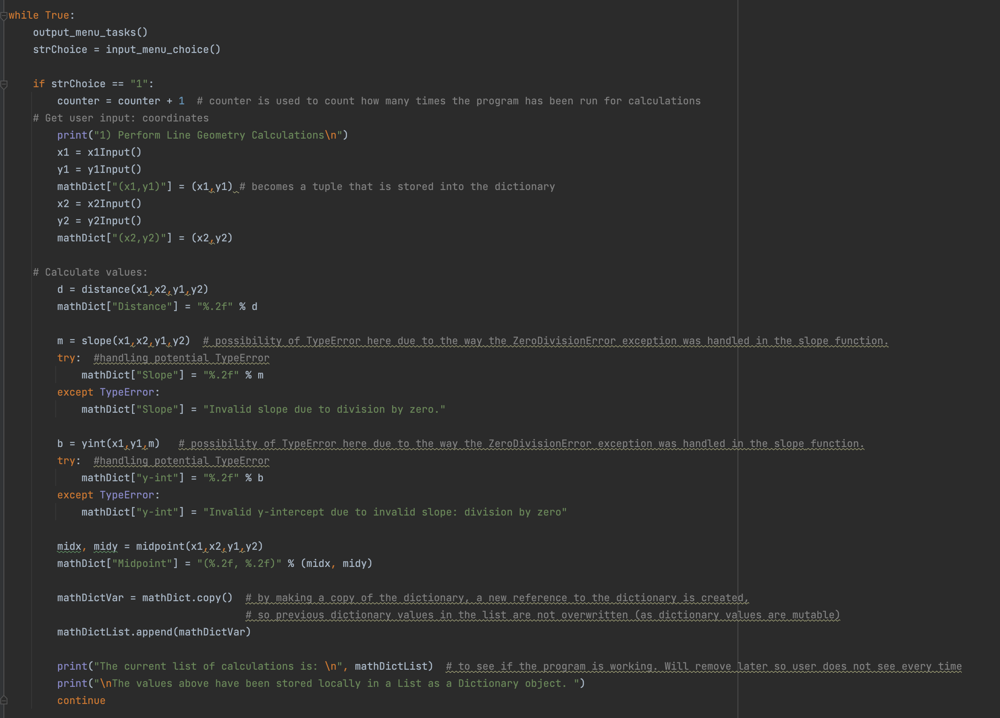
#### Figure 12. Code for menu option 1. 

The first thing that occurs in menu option 1 is that the counter variable, which counts how many times the calculator was run in the current session, increases in value by 1. This allows me to loop through the rows of the pickled binary file later to unpickle each row of data.

Next, the x1, y1, x2, and y2 functions are called to obtain user input for the two (x, y) coordinates. These coordinate values are put into a dictionary as dictionary values, assigned to the dictionary key corresponding to which coordinate it is assigned ((x1,y1) or (x2,y2)). The functions corresponding to each mathematical equation are then called, and the output of these functions are added to the dictionary. The two functions that do not require exception handling in this step are the distance function and the midpoint functions, and the two functions that require exception handling in this step are the slope and y-intercept functions due to the possibility of the ZeroDivisionError exception in the slope function. 

In the case that the slope function turns a ZeroDivisionError, I want to be sure that the slope’s dictionary value is a string of text saying that the slope is invalid. The same goes for the dictionary value corresponding to the y-intercept, since the y-intercept function uses the value for the slope. I do this by using a try statement to see if the slope value will add to the dictionary as a floating-point value. If this try statement works, all is well and the numerical value for the slope is used as the slope’s dictionary value. However, if the try statement does not work, a TypeError exception arises (since a string is not a floating-point value), which means that the ZeroDivisionError exception occurred in the slope function, and a string of text rather than a numerical value is assigned to the slope m and y-intercept b variables. In this case, a string that says the slope is invalid is instead used as the slope’s dictionary value. I handle the potential TypeError that would arise from the y-intercept function in the same way. 

Once all the variables and calculated values are added to the dictionary, I need to make a copy of the dictionary to append to the list. If this is not done, in each subsequent run of the program for separate calculations, if I attempt to append each dictionary to the list, each newly appended dictionary will convert the dictionary values of the previous dictionaries to its current dictionary values. This would happen because the dictionary keys are the same, and dictionary values are mutable. I learned this the hard way, and had to spend an hour figuring out why all my previous data was being overwritten! 

I finish with menu option 1 with a print statement to show the user that their data has been appended to the list, displaying the list back to them. 

### The Line Geometry Calculator Program: Main Body, Menu Option 2

While the functions defined above and menu option 1 demonstrated exception handling, menu option 2 demonstrated pickling. Figure 13 below shows the code for the menu option 2 selection (figure 13). 

#### Figure 13. Code for menu option 2, demonstrating pickling. 

I decided against writing a function for menu option 2, as it is not an operation that repeats throughout the code and therefore would not have an added benefit of tucking away in a function. I decided to write the code directly under menu option 2 for ease of reading and understanding my code.   

First, I open the file geomCalcs.dat, specifying the binary write access mode. This creates the binary file if the file does not already exist, and overwrites previous data if the file does exist. I chose to overwrite previous data so as to only save the calculations of the most recent run of the program, so the user can reference calculations of the most recent run. I then use the pickle.dump() function to save each row in the list, which corresponds to each dictionary in the list, to the binary file so that the results of each calculation run can be saved on a separate line. I don’t want to dump the entire list into the file, otherwise the entire list will be on the same line, disallowing me to demonstrate the iterative nature of the pickle.load() function during unpickling. 
Once the data is pickled, I close the connection to the file. 

### The Line Geometry Calculator Program: Main Body, Menu Option 3

Menu option 3 demonstrates the program’s ability to unpickle the saved binary data. Figure 14 below shows the code written to accomplish this (figure 14). 

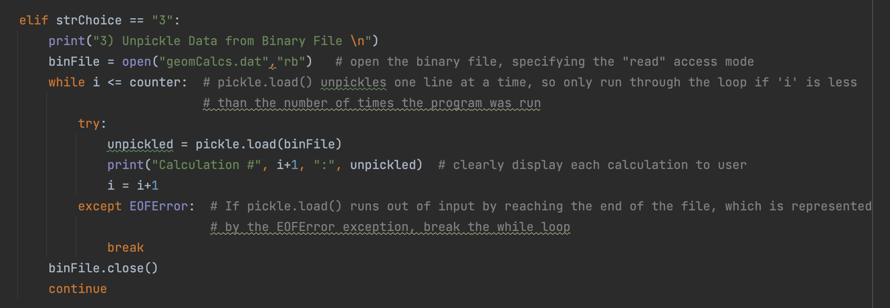
#### Figure 14. Code for menu option 3, demonstrating unpickling. 

Due to the iterative nature of the pickle.load() function in loading only one line at a time, I wanted to find a way to load the entire contents of the file into the program. I did so by using a while loop and two counter variables that I define at the beginning of the program: i and counter. The variable i is used as the iterative variable to allow the while loop to run so long as i is less than or equal to counter, which represents the number of times that the calculator was run in the current session and therefore the number of dictionaries in the list. While the iterative variable i is less than or equal to counter, I want to unpickle each row of data in the file to get the entire contents of the file. 

I wrote this loop slightly incorrectly to demonstrate a new type of exception, the EOFError exception, which I handle with a try statement and except clause. While i is less than counter, the pickle.load() function is run so that one line at a time is unpickled and loaded into the file, until every row of the file is loaded in. However, when i is equal to counter, each row of data has already been loaded into the file and the pickle.load() function has nothing else to load in. This would result in a EOFError exception, or an “end of file error” that shows that the loop has reached the end of the file. In the case that this exception arises, I want to break out of the while loop to stop loading data in. A message is then printed to the user which prints the results of each calculation that was run. The file is then closed. 

### The Line Geometry Calculator Program: Main Body, Menu Option 4

The very last menu option allows the user to exit out of the program. This was simple enough, and the code for this option is shown in the figure below (figure 15). 

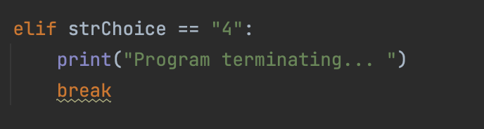
#### Figure 15. Code that exits out of the program. 

### A Full Run Through the Program: MacOS Terminal Command Line

Once the code for my program was written and its functionality was verified in PyCharm, I tested it in the MacOS Terminal command line to ensure proper functionality. The figure below shows the properly functioning of the program (figure 16). 

 
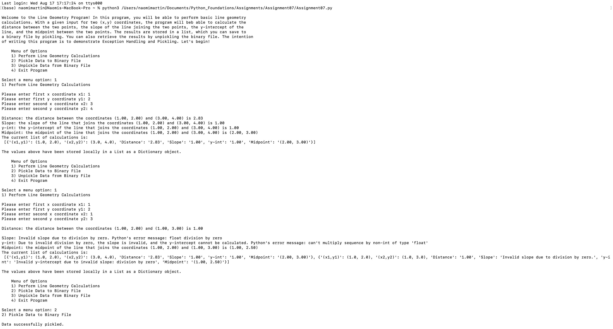

#### Figure 16. Full run through The Line Geometry Calculator program in the MacOS Terminal command line. 

I then checked the geomCalcs.dat file that the program generated, and saw that my data was properly serialized in binary format. It was still in a mildly human-readable format, and I could tell that both calculations had been saved by observation of some of the dictionary keys and values (figure 17). 

#### Figure 17. The geomCalcs.dat file that generated with the program run. 

## Demonstrating Exception Handling
The full run through the program above simply demonstrated that the program worked, but I want to highlight the use of exception handling. The first exception I want to demonstrate is the ValueError exception that would arise if a character string was inputted rather than a number (figure 18). 

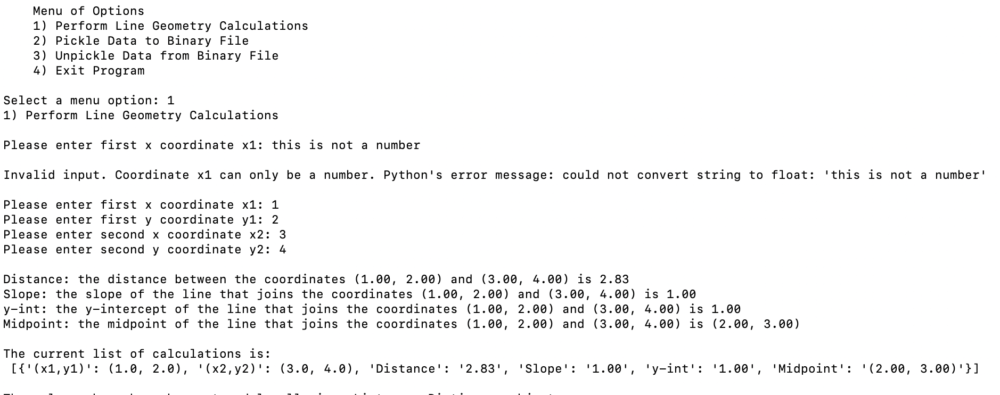
#### Figure 18. The ValueError exception is handled if a character string is inputted rather than a number. 

It seems like inputting a character string would instead turn a TypeError since we would expect a numerical value rather than a character string to be inputted here. However, the float() function does expect a string input in the form of a number. Therefore, the type is correct (string is expected and received), but the value is incorrect (letter received, not number), thus turning a ValueError. 

Due to the way I handled this exception, the program alerts the user that invalid input was entered, and shows the user what Python’s normal error message would be if this exception were not handled. The program then allows the user to input a valid number, and if a valid number is inputted for each coordinate, the program successfully executes and calculates the specified line geometry values. 

The next major exception that would occur in this program is the ZeroDivisionError, if the x1 and x2 coordinates specified are equal and the slope equation must divide by zero. The figure below demonstrates the handling of this exception (Figure 19). 

#### Figure 19. The ZeroDivisionError exception is handled by assigning character strings to the slope m and y-intercept b variables. 

Here, if the inputted x1 and x2 coordinates are equal, the slope equation will attempt to divide by zero, throwing the ZeroDivisionError exception. In this case, I assign character strings to the slope m and y-intercept b variables, which are shown in the list containing this run’s dictionary values. Python’s default error message will then be printed, along with a more understandable error message that I wrote. 

These two examples demonstrate my program’s use of exception handling methods, and allow greater flexibility for what is possible in a program. I like how these methods allow the program to continue to execute completely, without terminating it prematurely with a nasty error message.  

## Demonstrating Pickling and Unpickling
The menu options 2 and 3 demonstrate pickling and unpickling. The figure below shows a run-through of these menu options (figure 20). 

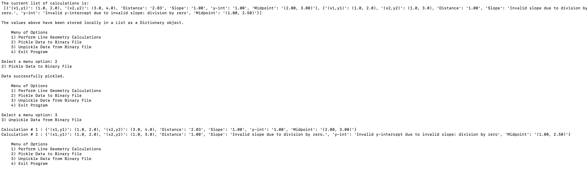
#### Figure 20. The menu options showing the data being pickled unpickled. 

Here, if the user decides to pickle the calculated data, a message is printed to the user that the data was successfully pickled. If they decide to unpickle the data, the data from the geomCalcs.dat file is deserialized back into its original dictionary form, and displayed back to the user. 

The figure below shows the geomCalcs.dat file with the serialized information (figure 21). 

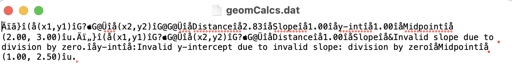
#### Figure 21. The binary geomCalcs.dat file containing the serialized information. 

With my Line Geometry Calculator program, which uses previously learned concepts of data types and loops, and incorporates the newly learned concepts of data pickling and exception handling, I believe I have demonstrated my understanding of this week’s learning goals and completed the assignment.

## Struggles
One of the main struggles I encountered while completing this assignment involved the concept of dictionary value mutability. After running through the line geometry calculations and adding the results to the dictionary, I wanted to append the dictionary to the list. This worked the first time, but the second time menu option 1 to perform the calculations was run, I noticed that the list containing my two dictionaries contained two of the same dictionary, rather than two different dictionaries. After spending an hour trying to figure out why this was happening, I realized it was because I was appending the dictionary with the name defined at the top of the script to the list each time, effectively changing the values (but not the keys) of the dictionaries in the list each time another was appended. I had forgotten about the concept of dictionary value mutability until I ran into this error. To sidestep this problem, I thought about instead using tuples to hold the calculated data, but I liked how dictionaries allow you to specify a dictionary key and assigned it a value. Therefore, after consultation with Google and programmer friends, I decided to create a new variable containing a copy of each dictionary, and append that variable to the list. In this way, each time menu option 1 is run, the dictionary values of the dictionary with the name defined at the beginning of the script change each time, but those in the copy do not, and therefore the copy’s dictionary values remain unchanged when a new dictionary is appended. 

Another struggle I encountered involved figuring out the best way to load each line of pickled data into the program. I decided that using a loop to iterate through the rows of the binary file was the best way to do this, but I was having trouble figuring out how exactly to write the loop. I eventually came up with the idea of using a counter after much trial and error. In fact, my “choice” to include the EOFError exception handling for when i=counter was not a choice, but rather a mistake that I had made when setting the while loop to run for i <= counter. When I first set the while loop to run this way, I thought the loop would stop properly when the loop reached the end of the file (this was a simple math mistake, as there would be no more rows to load in when i = counter). However, I encountered the EOFError exception and handled it. It wasn’t until the next day did I realize that if I set the while loop to run for i < counter, the loop would not reach the end of the file, and all rows of data would be loaded in. Despite this mathematical error, I decided to retain the EOFError exception handling to demonstrate another type of exception that I had not yet encountered in the textbook or online. 

## Conclusion
While this assignment could have been completed with a much simpler program, I wanted to go above the requirements of the assignment and create a more complicated program, incorporating the concepts learned in the previous weeks. I wanted to do this to not only demonstrate my growing knowledge of Python programming, but also because I learn best through practice and wanted to use this to solidify my knowledge. The most recent assignments we’ve completed involved editing Professor Root’s code, which is a separate skill in itself, but I wanted more practice with writing my own programs. I had a lot of fun completing this assignment, and thinking of ways to overcome novel problems (novel for me, but not the general programming world). I would appreciate feedback on ways to improve and streamline my programming in general, so I can utilize this knowledge in my career. 

